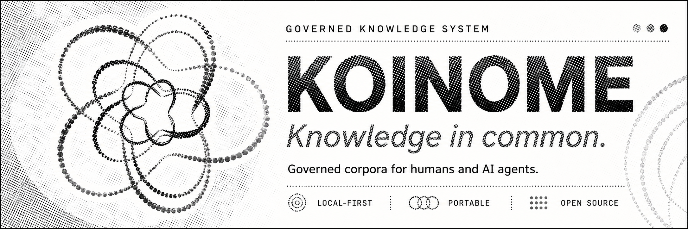

> **Knowledge in common.** A corpus of plain files you own. Agents help write it. A deterministic gate decides what gets in. You have final say. Forever portable.

---

## The problem

Monday, you explain your project to Claude Code: the architecture decision from March, the constraint that never made it into the code, the approach you already tried and abandoned. Tuesday, you open Cursor and explain it all again.

The memory features built to fix this all share one shape. Knowledge persists silently, in a provider's store, under a provider's account. You cannot open it in an editor, diff it, or take it with you. And when a remembered "fact" is stale or wrong, nothing can tell you where it came from. For decisions, work knowledge, and anything authoritative, that shape fails one absolute rule: **nothing should rewrite your knowledge while you sleep.**

## What Koinome is

Your knowledge lives in a **corpus**: a folder of plain Markdown and YAML on your own disk, versioned with git, readable by any editor and any agent. The `koinome` CLI keeps it healthy behind a deterministic validation gate. AI agents (Claude Code, Codex, Gemini CLI, Cursor) read it, help maintain it, and propose to it. They never control it.

No accounts. No server. No telemetry.

## What using it looks like

```bash
koinome new --name my-work --path ~/my-work
```

Open the corpus in your agent and run the `koinome-init` skill. From then on, the loop:

1. **The agent reads before acting.** The March decision, the constraint, the dead end: already in context. The re-explaining stops.
2. **The agent drafts into the corpus.** A note, a decision record, a synthesis page distilled from your chat exports.
3. **The gate decides.** `koinome doctor` and the git hook reject what breaks the contract: synthesis without cited sources, broken references, malformed records. The check is deterministic. No model, no network, nothing to hallucinate.
4. **You review the diff and commit.** Nothing becomes part of your corpus unattended.
5. **Delete Koinome tomorrow and nothing is lost.** Every note still opens in any editor, still diffs in git, still greps like anything else.

Step five is the **turn-it-off test**, and it is how to judge any memory system: delete the tooling and see what your knowledge is still worth. Koinome is built to pass it on purpose. The files are the product.

## Why this is not just a folder of Markdown

A folder of Markdown plus git already beats most memory products, and if that works for you, keep it. Koinome earns its difference at the boundary.

Every AI memory system on the market is single-principal by architecture: one owner, one boundary, one authority. Nobody's knowledge actually works that way. I keep three corpora: personal, academic, and work. One person operates all three, but three different principals stand behind them, and what may move from the work corpus into the personal one is not what may move back. Today's memory products cannot even represent that question. I have lived the worst version of it: across a long career, every time I left an employer I destroyed everything I had written there, the legitimate lessons along with the confidential material, because nothing could tell them apart.

Koinome's thesis is that knowledge should move between people, teams, and organisations through explicit, governed operations (share, contribute, merge, split, federate), carrying provenance and policy, never as silent copies. **Sharing is the point.** The individual product in this repository is its foundation, because you cannot govern movement between corpora until the corpus exists as a unit.

Cross-corpus operations are design scope, developed through public RFCs. They are **not** shipped software, and this project never blurs the two. The full argument, roadmap, and binding commitments: **[docs/STRATEGY.md](docs/STRATEGY.md)**.

## Quick start

```bash
pipx install .        # or: uv tool install .   or run ./koinome-cli in place
koinome new           # interactive; add --name and --path to script it
```

Requires Python 3.10+ and PyYAML. Then open the corpus in your agent and run `koinome-init`. Full walkthrough, import from provider exports, sync, and recovery: **[docs/USAGE.md](docs/USAGE.md)**.

## Commands

| command                  | what it does                                                       |
| ------------------------ | ------------------------------------------------------------------ |
| `koinome new`            | Create a corpus                                                    |
| `koinome seed`           | Normalise a provider export into an import staging area            |
| `koinome doctor CORPUS`  | Validate a corpus and refresh navigation maps                      |
| `koinome check CORPUS`   | Read-only conformance check, CI-safe                               |
| `koinome upgrade CORPUS` | Upgrade Koinome-managed tooling without touching your notes        |

## Guarantees

1. **Plain text forever.** CommonMark, YAML frontmatter, git, todo.txt. Every note opens with no Koinome tooling installed.
2. **Deterministic validation.** No model, no network, no server inside the gate. AI assists around it, never inside it.
3. **Nothing rewrites your notes unattended.** The only optional scheduled job is git sync.
4. **Provenance is enforced.** Derived pages cite their sources or the validator rejects them.
5. **Sensitive boundaries are physical.** Keep sensitive material in a separate private corpus on a path no agent reaches.
6. **No accounts, no telemetry.** Individual use is account-free forever, and nothing phones home. Not opt-out. None.
7. **Complete and free.** The individual corpus tooling is a finished local-first product under Apache-2.0. Not a trial, not a limited edition, not a funnel.

## Status

Pre-1.0, design-driven, part-time maintained, built in the open. I have kept a knowledge system of my own in daily use since 2014; Koinome is its public, governed rewrite, and I run my own three corpora on it. v0.1 ships only after I have used it daily for thirty consecutive days in real work. Next: an MCP server exposing scoped context and a formal propose-and-approve flow, then the first governed cross-corpus operation, share, between two corpora on one machine.

Issues and RFC feedback are welcome; response times will be honest rather than fast.

## Licence

Apache License 2.0. See [LICENSE](LICENSE) and [NOTICE](NOTICE). Contributions are accepted under the [Developer Certificate of Origin](https://developercertificate.org/); there is no CLA. See [CONTRIBUTING.md](CONTRIBUTING.md).